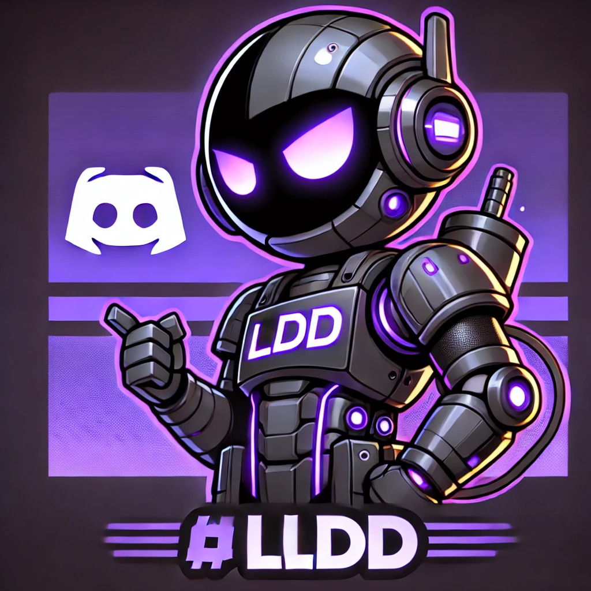
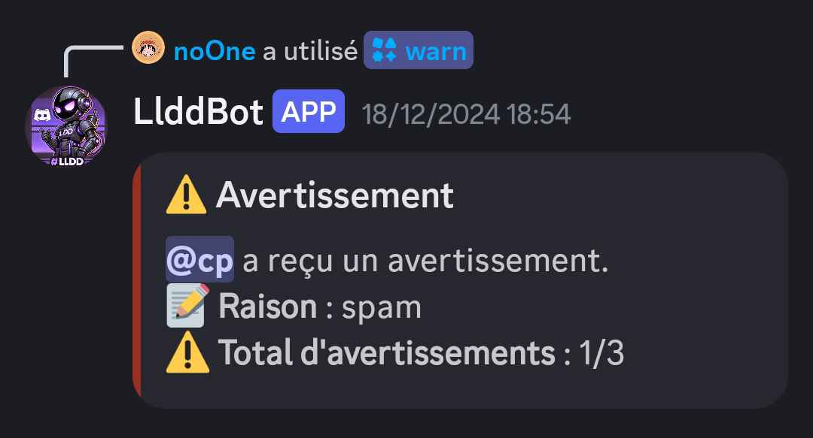
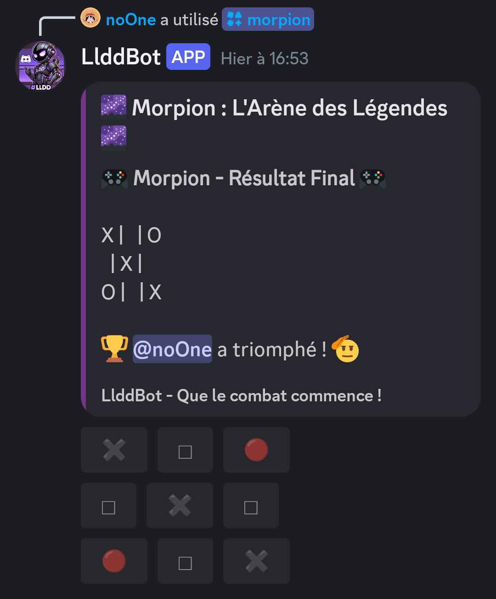
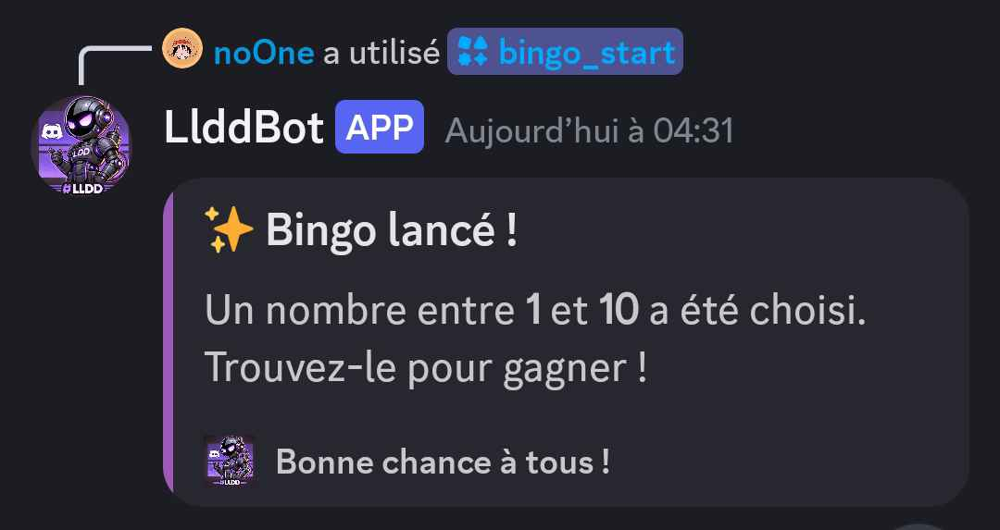
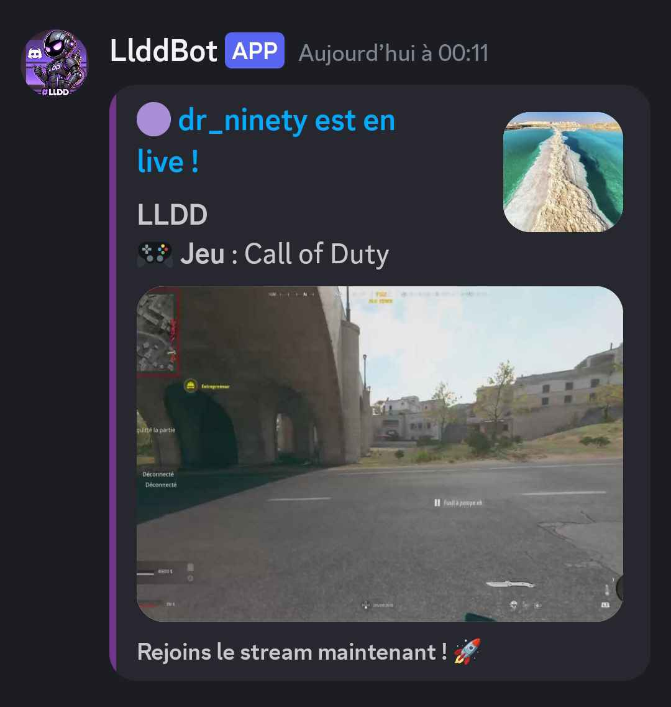
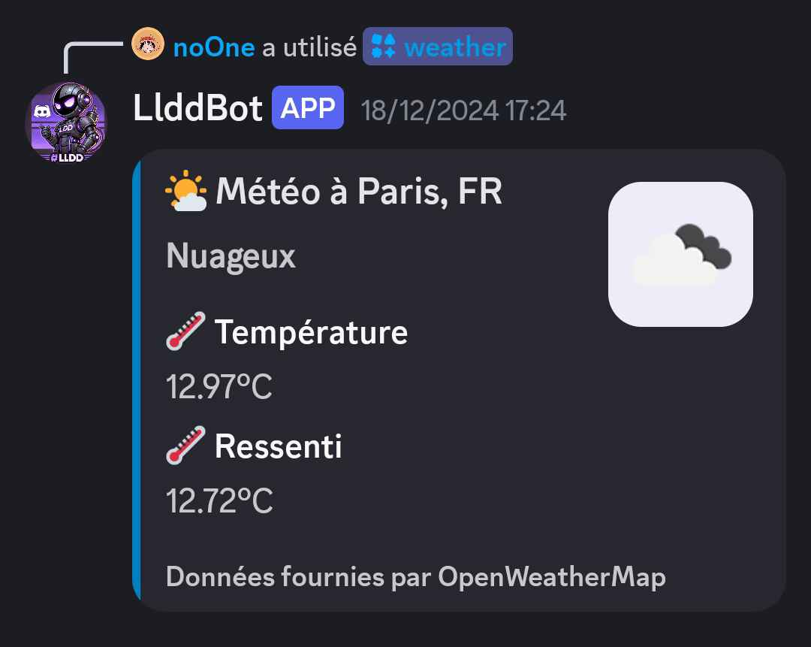
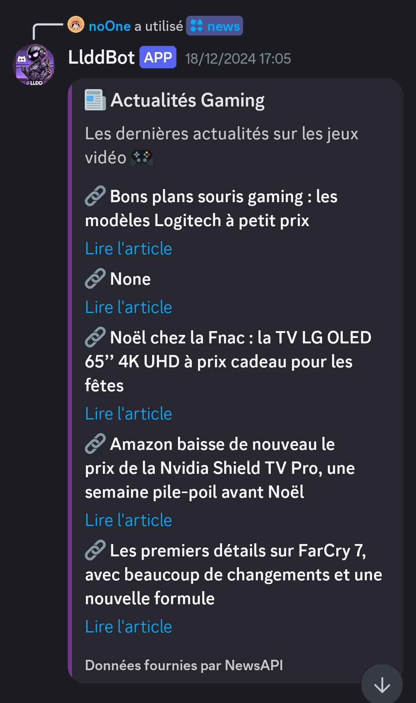

# LlDd DiscordBot


<p align="left">
  
</p>

A complete and customizable Discord bot designed to manage and engage community servers.  
This bot includes moderation tools, mini-games, advanced logging, activity statistics, and much more.

## Table of Contents

1. [Project Description](#project-description)
2. [Requirements](#requirements)
3. [Installation](#installation)
4. [Project Structure](#project-structure)
5. [Available Commands](#available-commands)
6. [Adding Features](#adding-features)
7. [Contributions](#contributions)

---

## Project Description

This Discord bot offers several key features:
- **Moderation**: Commands for banning, kicking, and managing warnings.
- **Mini-games**: Gaming quizzes, dice rolls.
- **Advanced logging**: Tracks message edits/deletions and role changes.
- **Statistics**: Provides server activity data and Call of Duty stats.
- **Role assignment**: Automatically assigns roles to new members.
- **Twitch notifications**: Alerts for live streams (currently disabled).

---

## Requirements
📚
- **Python 3.8+**: [Download Python](https://www.python.org/downloads/)
- **Discord API Key**: Create your bot on the [Discord Developer Portal](https://discord.com/developers/applications).
- *(Optional)* Twitch and Call of Duty API keys for advanced features.

---

## Installation
🛠️
1. Clone this repository:
   ```bash
   git clone <REPO_URL>
   cd project/

    ```
   
2. Install the required dependencies:
    ```bash
    pip install -r requirements.txt
   ```
   
3. Configure your API keys:
⚠️ **Important** : Never share your `.env` file containing API keys in public repositories. Make sure to add  `.env` or `config` to your `.gitignore`.
    * Create `config` file in the root directory:
    ```
    DISCORD_TOKEN=ton_token_discord
    TWITCH_CLIENT_ID=ton_client_id_twitch
    TWITCH_CLIENT_SECRET=ton_secret_twitch
    COD_API_KEY=ta_clé_api_cod
    LOG_FILE=bot_logs.log
    LOG_LEVEL=INFO
    ```
   
4. Run the bot:
    ```bash
   python main.py
    ```

## Project Structure
🧩
```
    project/
    ├── assets/
    ├── cogs/
    │   ├── filters.py         # Gestion des mots interdits et du spam
    │   ├── games.py           # Commandes pour les mini-jeux (quiz, lancer de dés)
    │   ├── message_log.py         # Logs des messages modifiés/supprimés et des rôles
    │   ├── moderation.py      # Commandes de modération
    │   ├── roles.py           # Attribution automatique de rôles
    │   ├── stats.py           # Commande pour les statistiques du serveur
    │   ├── twitch.py          # Notifications pour les streamers Twitch
    │   ├── warnings.py        # Gestion des avertissements
    │   ├── welcome.py         # Messages de bienvenue
    ├── data/                  # data on json
    ├── logs/                  # bot logs
    ├── utils/
    │   ├── logger.py          # Gestion des logs globaux
    ├── config                 # Clés API et secrets
    ├── main.py                # Point d'entrée principal
    ├── requirements.txt       # Dépendances nécessaires
```

## Available Commands
📜
### **Utility Commands**
* **`/status`**  
  ➡️ Displays the bot's current status (uptime, loaded cogs, etc.).  
* **`/restart`** *(Admin only)*  
  ➡️ Restarts the bot.

---

### **Moderation Commands**
* **`/ban`** @User [reason] *(Requires `ban_members` permission)*  
  ➡️ Bans a user with an optional reason.  
* **`/kick`** @User [reason] *(Requires `kick_members` permission)*  
  ➡️ Kicks a user with an optional reason.  
* **`/banned_list`**  
  ➡️ Lists all banned users in the server.


---

### **Warning Commands**
* **`/warn`** @User [reason] *(Requires `manage_messages` permission)*  
  ➡️ Warns a user for a given reason.  
* **`/warnings`** @User  
  ➡️ Displays all warnings for a user.  
* **`/clear_warnings`** @User  
  ➡️ Clears all warnings for a user.  
* **`/set_max_warnings`** <number>  
  ➡️ Sets the maximum number of warnings before applying a sanction.
<p align="left">
  
</p>

---

### **Role Commands**
* **`/set_default_roles`** role1, role2 *(Admin only)*  
  ➡️ Sets default roles to be assigned automatically to new members.  
* **`/show_default_roles`**  
  ➡️ Displays the current default roles configuration.

---

### **Mini-Game Commands**
* **`/quiz`**  
  ➡️ Starts a gaming trivia quiz using the OpenTDB API.  
* **`/roll`** [faces=6]  
  ➡️ Rolls a die with the specified number of faces (default: 6).  
* **`/rps`** `pierre|papier|ciseaux`  
  ➡️ Play rock-paper-scissors against the bot.
* **`morpion`** `[opponent: @user|LlddBot] [difficulty: Facile|Normale|Difficile]`  
  ➡️ Start a Tic-Tac-Toe game against another user or LlddBot. Choose difficulty for bot opponents.
* **`/bingo start`**  
  ➡️ Start a Bingo game.
* **`/bingo stop`** 
  ➡️ End the current Bingo game.
<p align="left">
  
</p>
<p align="left">
  
</p>

---

### **Statistics Commands**
* **`/stats`**  
  ➡️ Displays server statistics such as member count, roles, and channels.  
* **`/codstats`** [username] [platform]  
  ➡️ Fetches Call of Duty player stats.  
* **`/leaderboard`**  
  ➡️ Shows the trivia leaderboard.

---

### **Poll Commands**
* **`/poll`** "Question" "Option1, Option2, Option3" [duration in minutes]  
  ➡️ Creates an interactive poll with reactions and optional timer. Results are displayed automatically.

---

### **Hugging Face Commands**
* **`/ask_hf`** [question]  
  ➡️ Ask a question to Hugging Face models like Bloom or Falcon.

---

### **Welcome Commands**
* **`/set_rules_channel`** <#channel>  
  ➡️ Configures the rules channel.  
* **`/set_welcome_channel`** <channel_name>  
  ➡️ Configures the welcome channel.

---

### **ChatGPT Commands**
* **`/ask`** [question]  
  ➡️ Ask a question to ChatGPT using the OpenAI API.

---

### **Twitch Commands**
* **`/add_twitch_streamer`** [streamer_name]  
  ➡️ Add a Twitch streamer to monitor.  
* **`/list_twitch_streamers`**  
  ➡️ Display the list of monitored streamers.  
* **`/set_twitch_channel`** <#channel>  
  ➡️ Set the channel for Twitch live notifications.
<p align="left">
  
</p>

---

### Others API:
* **`/weather`** `<city>`
  ➡️ Affiche la météo actuelle d'une ville.

* **`/news`**
  ➡️ Affiche les dernières actualités gaming.
<p align="left">
  
</p>

<p align="left">
  
</p>

---

### **🚀 Recent Updates**
- **Hugging Face integration** for NLP models like Bloom and Falcon.
- **Improved polling system**: Dynamic timers and automatic results display.
- **ChatGPT refactor**: Compatibility with OpenAI v1.0.0.
- **Structured JSON Handling**: Moved all JSON files to the `/data/` directory with auto-creation and validation.
- **Improved Logging**: Added advanced log checks and detailed errors.
- **Trivia Game**: Integrated with **OpenTDB API** for gaming-related questions.
- **Leaderboard**: New command `/leaderboard` to view trivia scores.
- **RPS Mini-Game**: Added `/rps` (rock-paper-scissors) game.
- **Automatic Role Assignment**: Default roles are now assigned to new members.
- **Enhanced Moderation**: Improved `/warn` and warning clearing logic.
- **Twitch Integration**: Added live notifications with `/set_twitch_channel` and `/add_twitch_streamer`.
- **Performance Optimization**: Refactored cogs for modularity and scalability.

---

### **Étapes pour tester**
1. **Lance ton bot et utilise les commandes listées.**
2. Assure-toi que chaque fonctionnalité répond correctement et affiche les informations dans des embeds cohérents.


---

## Exemple de Commandes Avancées
🛠️
### Modération :
 ```
/ban @Player1 Comportement inapproprié /kick @Player2 Inactivité prolongée
 ```

### Mini-Jeux :
 ```
 /quiz /roll 20
 ```

## Adding Features
🔧
### Create a New Command :
1. **Create a file in the `cogs/` folder**  
   Example : `my_feature.py`.

2. **Add a class with hybrid or slash commands :**  
   Example ofhybride command :
   ```python
   from discord.ext import commands

   class MyFeature(commands.Cog):
       def __init__(self, bot):
           self.bot = bot

       @commands.hybrid_command(name="ma_commande", description="Ma nouvelle commande")
       async def ma_commande(self, ctx):
           if isinstance(ctx, discord.Interaction):
               await ctx.response.send_message("Ceci est une nouvelle commande Slash !")
           else:
               await ctx.send("Ceci est une nouvelle commande classique !")
   ```
   
3. **Add a `setup` function to integrate the cog.**
   ```python
   async def setup(bot):
       await bot.add_cog(MyFeature(bot))
   ```
   
4. **Reload or restart the bot to apply the changes.**
   ```
   !reload_cog cogs.my_feature
   ```

## Contributions
🤝
Contributions are welcome! To contribute:

1. Fork this repository.
2. Create a branch for your feature (e.g., `feat/ajout-sondage`).
3. Test your changes locally.
4. Open a pull request with detailed explanations.

### ✅ Pull Request Checklist: :
- [ ] Added a feature or bug fix.
- [ ] Tested locally to avoid regressions.
- [ ] Updated documentation if necessary.

## ⚖️ Licence

This project is licensed under the **MIT License**. You are free to use, modify, and distribute it.
See the [LICENSE](./LICENSE) file for more details.


⭐ If you like this project, consider giving it a star! ⭐
